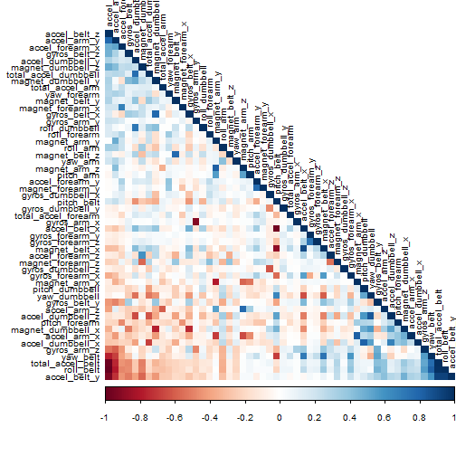
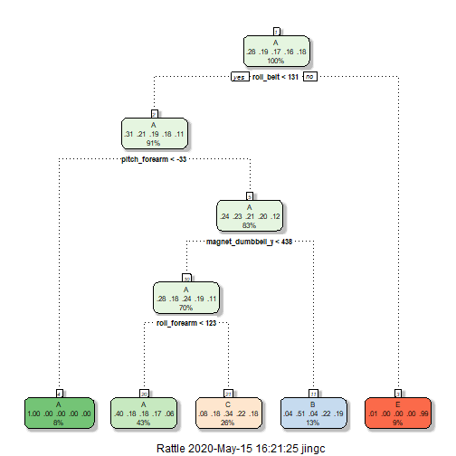

# Course8_Practical_Machine_Learning_Course_Project  
# Human Activity Recognition  
*Jingchen Huyan* _ *May 15, 2020*  

# I. Brief Introduction   
This report is aimed at choosing machine learning model to predict 5 different types of excercise by using data from accelerometers on the belt, forearm, arm, and dumbell of 6 participants.   
More information is available from: [Human Activity Recognition](https://web.archive.org/web/20161224072740/http:/groupware.les.inf.puc-rio.br/har) (see the section on the Weight Lifting Exercise Dataset). ^[Velloso, E.; Bulling, A.; Gellersen, H.; Ugulino, W.; Fuks, H. Qualitative Activity Recognition of Weight Lifting Exercises. Proceedings of 4th International Conference in Cooperation with SIGCHI (Augmented Human '13) . Stuttgart, Germany: ACM SIGCHI, 2013.]  

# II. Loading Data  

```r
# Loading data
if(!file.exists("./data")){dir.create("./data")}
fileUrl1 <- "https://d396qusza40orc.cloudfront.net/predmachlearn/pml-training.csv"
download.file(fileUrl1, destfile = "./data/trainset.csv", mode="wb")
fileUrl2 <- "https://d396qusza40orc.cloudfront.net/predmachlearn/pml-testing.csv"
download.file(fileUrl2, destfile = "./data/testset.csv", mode="wb")
# read data
trainSet <- read.csv("./data/trainset.csv", header = TRUE)
validationSet<- read.csv("./data/testset.csv", header = TRUE)
# clean the data (remove NAs and non-related variables)
trainData<- trainSet[, colSums(is.na(trainSet)) == 0]
validData <- validationSet[, colSums(is.na(validationSet)) == 0]
trainData <- trainData[, -c(1:7)]
validData <- validData[, -c(1:7)]
```

# III. Prepare for prediction  
## i. Data slicing and remove near zero variance  

```r
# data slicing
set.seed(2020) 
library(caret)
```

```
## Loading required package: lattice
```

```
## Loading required package: ggplot2
```

```r
inTrain <- createDataPartition(trainData$classe, p=0.60, list=F)
trainData <- trainData[inTrain, ]
testData <- trainData[-inTrain, ]
# remove near-zero-variance
NZV <- nearZeroVar(trainData)
trainData <- trainData[, -NZV]
testData  <- testData[, -NZV]
```
## ii. Correlation analysis  

```r
corMatrix <- cor(trainData[, -53])
library(corrplot)
```

```
## corrplot 0.84 loaded
```

```r
corrplot(corMatrix, order = "FPC", method = "color", type = "lower", 
         tl.cex = 0.8, tl.col = rgb(0, 0, 0))
```


  
As the plot shows, the darker color means higher correlation between two variables. In preprocessing step, we can use principal components analysis (PCA) to extract main components from 52 variables. However, as there is only few correlated variables, so we would not apply PCA in for this data set.  

# IV. Model Building  
As the outcome of this experiment are separated in 5 classes, we would rather choose machine learning method that could split variables into different groups. Those methods are: Decision Tree, Random Forest and Gradient Boosting Method.  

First of all, to limit the effects of overfitting, and improve the efficicency of the models, we will use the **cross-validation** technique. Usually choose 5 or 10 folds. 10 folds needs longer run times with no significant increase of the accuracy, so here we choose 5 folds.  

```r
# cross-validation
trControl <- trainControl(method="cv", number=5)
```

## i. Decision Tree

```r
# fit decision tree model
library(rattle)
```

```
## Rattle: A free graphical interface for data science with R.
## Version 5.3.0 Copyright (c) 2006-2018 Togaware Pty Ltd.
## Type 'rattle()' to shake, rattle, and roll your data.
```

```r
decisionTreeMod1 <- train(classe ~ ., method="rpart", data=trainData, trControl=trControl)
# plot model
fancyRpartPlot(decisionTreeMod1$finalModel)
```


Now, validate the model “decisionTreeMod1” on the testData to find out how well it performs by looking at its accuracy.  

```r
predictTreeMod1 <- predict(decisionTreeMod1, testData)
tree <- confusionMatrix(predictTreeMod1, testData$classe)
tree$table
```

```
##           Reference
## Prediction    A    B    C    D    E
##          A 1220  355  367  348  112
##          B   26  336   26  139  129
##          C   95  214  438  273  228
##          D    0    0    0    0    0
##          E    2    0    0    0  418
```

```r
tree$overall[1]
```

```
##  Accuracy 
## 0.5103682
```
The accuracy of the model is only 0.5103682, which means the **out-of-sample-error** is quite high about 0.49.  

## ii. Random Forest  

```r
# fit random forest model
randomForestMod1 <- train(classe ~ ., data=trainData, method="rf", trControl=trControl)
randomForestMod1$finalModel
```

```
## 
## Call:
##  randomForest(x = x, y = y, mtry = param$mtry) 
##                Type of random forest: classification
##                      Number of trees: 500
## No. of variables tried at each split: 27
## 
##         OOB estimate of  error rate: 0.84%
## Confusion matrix:
##      A    B    C    D    E class.error
## A 3341    4    2    0    1 0.002090800
## B   21 2251    5    2    0 0.012286090
## C    0   17 2031    6    0 0.011197663
## D    0    2   24 1902    2 0.014507772
## E    0    1    4    8 2152 0.006004619
```
Now, validate the model “randomForestMod1” on the testData to find out how well it performs by looking at its accuracy.  

```r
predictForestMod1<- predict(randomForestMod1, testData)
forest<- confusionMatrix(predictForestMod1, testData$classe)
forest$table
```

```
##           Reference
## Prediction    A    B    C    D    E
##          A 1343    0    0    0    0
##          B    0  905    0    0    0
##          C    0    0  831    0    0
##          D    0    0    0  760    0
##          E    0    0    0    0  887
```

```r
forest$overall[1]
```

```
## Accuracy 
##        1
```
The accuracy of this model is 1, which means the **out-of-sample-error** is very close to 0.  

## iii. Gradient Boosting Method  

```r
# fit gradient boosting model
boostingMod1<- train(classe~., data=trainData, method="gbm", trControl=trControl, verbose=FALSE )
boostingMod1$finalModel
```

```
## A gradient boosted model with multinomial loss function.
## 150 iterations were performed.
## There were 52 predictors of which 52 had non-zero influence.
```
Now, validate the model “boostingMod1” on the testData to find out how well it performs by looking at its accuracy.  

```r
predictBoostingMod1<- predict(boostingMod1, testData)
boosting<- confusionMatrix(predictBoostingMod1, testData$classe)
boosting$table
```

```
##           Reference
## Prediction    A    B    C    D    E
##          A 1329   17    0    0    0
##          B    8  871   17    0    3
##          C    5   17  807   17    4
##          D    1    0    6  738   10
##          E    0    0    1    5  870
```

```r
boosting$overall[1]
```

```
##  Accuracy 
## 0.9765129
```
The accuracy of this model is 0.9746085 , which means the **out-of-sample-error** is about 0.03.  

# V. Conclusion  
The accuracy and the out of sample error of the three modeling methods are:  
1. Decision Tree : Accuracy 0.51, Error 0.49  
2. Random Forest : Accuracy 1, Error 0  
3. Gradient Boosting : Accuracy 0.97, Error 0.03  
In conclusion, as the error of Random Forest is the lowest, this model will be choosed to predict the 20 quiz (using validData).  

# VI. Final Prediction  

```r
quizTest<- predict(randomForestMod1, validData)
quizTest
```

```
##  [1] B A B A A E D B A A B C B A E E A B B B
## Levels: A B C D E
```


        
